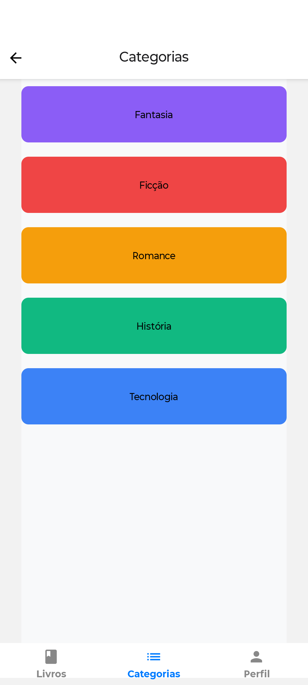

# 📚 Livraria Digital

Aplicativo desenvolvido em **React Native** com **Expo**, que simula uma livraria digital. O app permite listar categorias de livros e visualizar detalhes como título, autor, capa e descrição. 

## 🧩 Tecnologias utilizadas

- [React Native](https://reactnative.dev/)
- [Expo](https://expo.dev/)
- [TypeScript](https://www.typescriptlang.org/)
- [FlatList](https://reactnative.dev/docs/flatlist) para renderização de listas
- `Alert` do React Native para interações simples

## 🔍 Funcionalidades

- Exibição de categorias de livros com cores e contagem
- Exibição de detalhes dos livros com título, autor e descrição
- Navegação simples e intuitiva
- Layout responsivo e estilizado

## 📸 Capturas de tela

## 🏠 Tela de Inicial

### 📚 Tela de Categorias

### 📖 Tela de Livros

### 👤 Detalhes de Perfil

### 📘 Detalhes do Livro

